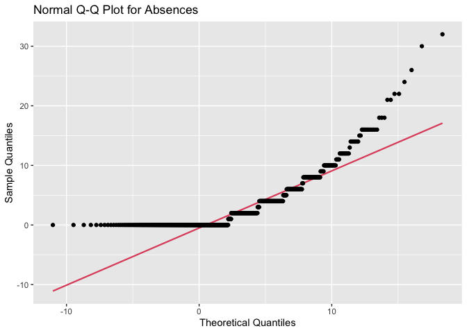
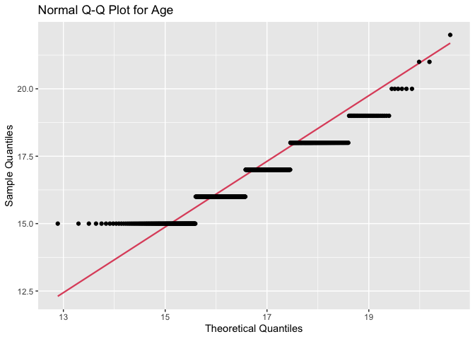
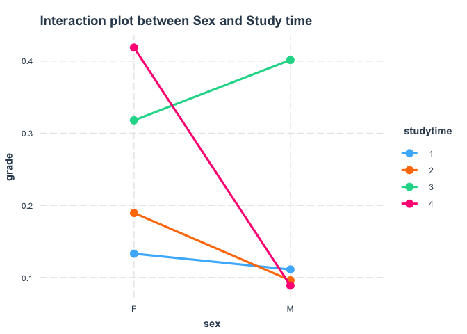
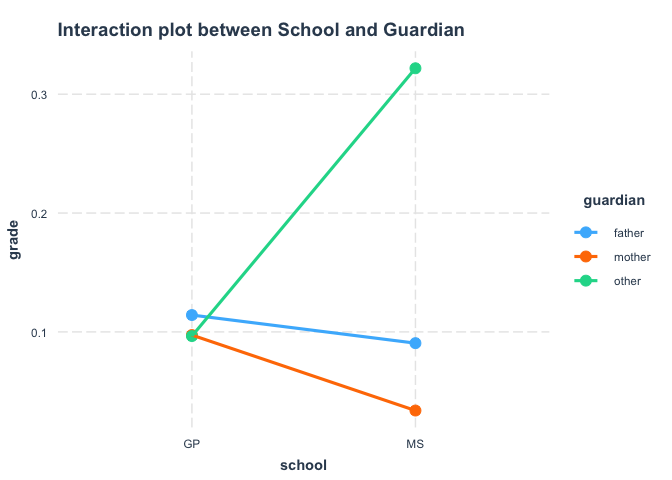
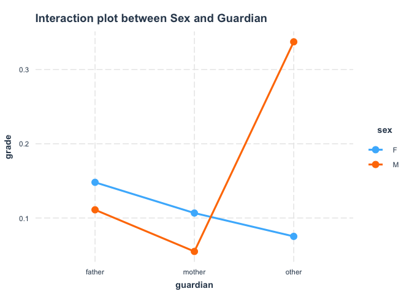
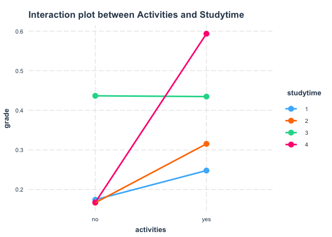
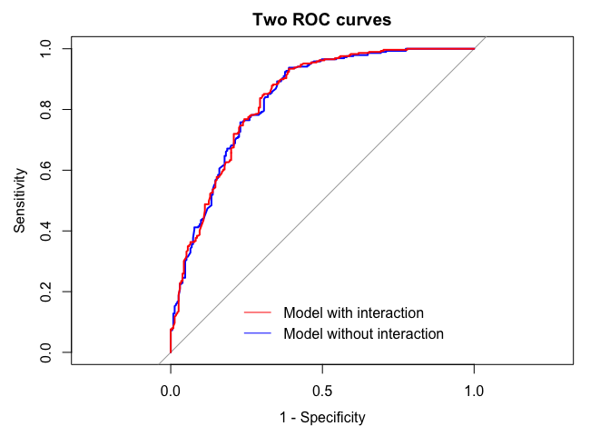

Rcode
================
2023-05-04

The purpose of this project is to understand how factors like a
student’s social, economic, and personal background can influence the
student’s final grade in a Portuguese course. Logistic regression will
be used to create a model that can predict whether a student will pass
or fail based on the most important factors.

# Data cleaning

This dataset has no missing values.

Since the purpose of this analysis is to predict the final grade, only
the G3 variable will be considered for the target variable. Therefore,
the G1 and G2 variables will be disregarded from this point.

To facilitate a logistic regression model, a new variable called grade
will be created. It classifies passing (1) as having a G3 grade of 12 or
above and failing (0) as having a G3 grade below 12.

``` r
# import data
student.por <- read.csv("~/Documents/Langara /Semester 2/Predictive Analytics - Qualitative Data (Qual)/Project/data/student-por.csv", 
                        sep=";", stringsAsFactors=T)
attach(student.por)
summary(student.por)
```

    ##  school   sex          age        address famsize   Pstatus      Medu      
    ##  GP:423   F:383   Min.   :15.00   R:197   GT3:457   A: 80   Min.   :0.000  
    ##  MS:226   M:266   1st Qu.:16.00   U:452   LE3:192   T:569   1st Qu.:2.000  
    ##                   Median :17.00                             Median :2.000  
    ##                   Mean   :16.74                             Mean   :2.515  
    ##                   3rd Qu.:18.00                             3rd Qu.:4.000  
    ##                   Max.   :22.00                             Max.   :4.000  
    ##       Fedu             Mjob           Fjob            reason      guardian  
    ##  Min.   :0.000   at_home :135   at_home : 42   course    :285   father:153  
    ##  1st Qu.:1.000   health  : 48   health  : 23   home      :149   mother:455  
    ##  Median :2.000   other   :258   other   :367   other     : 72   other : 41  
    ##  Mean   :2.307   services:136   services:181   reputation:143               
    ##  3rd Qu.:3.000   teacher : 72   teacher : 36                                
    ##  Max.   :4.000                                                              
    ##    traveltime      studytime        failures      schoolsup famsup     paid    
    ##  Min.   :1.000   Min.   :1.000   Min.   :0.0000   no :581   no :251   no :610  
    ##  1st Qu.:1.000   1st Qu.:1.000   1st Qu.:0.0000   yes: 68   yes:398   yes: 39  
    ##  Median :1.000   Median :2.000   Median :0.0000                                
    ##  Mean   :1.569   Mean   :1.931   Mean   :0.2219                                
    ##  3rd Qu.:2.000   3rd Qu.:2.000   3rd Qu.:0.0000                                
    ##  Max.   :4.000   Max.   :4.000   Max.   :3.0000                                
    ##  activities nursery   higher    internet  romantic      famrel     
    ##  no :334    no :128   no : 69   no :151   no :410   Min.   :1.000  
    ##  yes:315    yes:521   yes:580   yes:498   yes:239   1st Qu.:4.000  
    ##                                                     Median :4.000  
    ##                                                     Mean   :3.931  
    ##                                                     3rd Qu.:5.000  
    ##                                                     Max.   :5.000  
    ##     freetime        goout            Dalc            Walc          health     
    ##  Min.   :1.00   Min.   :1.000   Min.   :1.000   Min.   :1.00   Min.   :1.000  
    ##  1st Qu.:3.00   1st Qu.:2.000   1st Qu.:1.000   1st Qu.:1.00   1st Qu.:2.000  
    ##  Median :3.00   Median :3.000   Median :1.000   Median :2.00   Median :4.000  
    ##  Mean   :3.18   Mean   :3.185   Mean   :1.502   Mean   :2.28   Mean   :3.536  
    ##  3rd Qu.:4.00   3rd Qu.:4.000   3rd Qu.:2.000   3rd Qu.:3.00   3rd Qu.:5.000  
    ##  Max.   :5.00   Max.   :5.000   Max.   :5.000   Max.   :5.00   Max.   :5.000  
    ##     absences            G1             G2              G3       
    ##  Min.   : 0.000   Min.   : 0.0   Min.   : 0.00   Min.   : 0.00  
    ##  1st Qu.: 0.000   1st Qu.:10.0   1st Qu.:10.00   1st Qu.:10.00  
    ##  Median : 2.000   Median :11.0   Median :11.00   Median :12.00  
    ##  Mean   : 3.659   Mean   :11.4   Mean   :11.57   Mean   :11.91  
    ##  3rd Qu.: 6.000   3rd Qu.:13.0   3rd Qu.:13.00   3rd Qu.:14.00  
    ##  Max.   :32.000   Max.   :19.0   Max.   :19.00   Max.   :19.00

``` r
head(student.por)
```

    ##   school sex age address famsize Pstatus Medu Fedu     Mjob     Fjob     reason
    ## 1     GP   F  18       U     GT3       A    4    4  at_home  teacher     course
    ## 2     GP   F  17       U     GT3       T    1    1  at_home    other     course
    ## 3     GP   F  15       U     LE3       T    1    1  at_home    other      other
    ## 4     GP   F  15       U     GT3       T    4    2   health services       home
    ## 5     GP   F  16       U     GT3       T    3    3    other    other       home
    ## 6     GP   M  16       U     LE3       T    4    3 services    other reputation
    ##   guardian traveltime studytime failures schoolsup famsup paid activities
    ## 1   mother          2         2        0       yes     no   no         no
    ## 2   father          1         2        0        no    yes   no         no
    ## 3   mother          1         2        0       yes     no   no         no
    ## 4   mother          1         3        0        no    yes   no        yes
    ## 5   father          1         2        0        no    yes   no         no
    ## 6   mother          1         2        0        no    yes   no        yes
    ##   nursery higher internet romantic famrel freetime goout Dalc Walc health
    ## 1     yes    yes       no       no      4        3     4    1    1      3
    ## 2      no    yes      yes       no      5        3     3    1    1      3
    ## 3     yes    yes      yes       no      4        3     2    2    3      3
    ## 4     yes    yes      yes      yes      3        2     2    1    1      5
    ## 5     yes    yes       no       no      4        3     2    1    2      5
    ## 6     yes    yes      yes       no      5        4     2    1    2      5
    ##   absences G1 G2 G3
    ## 1        4  0 11 11
    ## 2        2  9 11 11
    ## 3        6 12 13 12
    ## 4        0 14 14 14
    ## 5        0 11 13 13
    ## 6        6 12 12 13

``` r
#detach(student.por)

# missing values 
# number of missing values in data set : 0
sum(is.na(student.por))
```

    ## [1] 0

``` r
# redefine target variable
# G3: Pass (1): 12 >= , Fail (0) : <12
grade =ifelse(G3 >= 12, 1,0 ) #dummy variable

# add new target variable
student.por$grade = grade

# convert variables to categorical

#convert variables to categorical variable:
cols <- c("school", "address", "famsize",'Pstatus','Medu','Fedu','Mjob','Fjob',
          'reason','guardian','traveltime','studytime','failures','schoolsup','famsup',
          'paid','activities','nursery','higher','internet', 'romantic','famrel','freetime',
          'goout','Dalc','Walc','health','sex')
student.por[cols] <- lapply(student.por[cols], factor)

summary(student.por)
```

    ##  school   sex          age        address famsize   Pstatus Medu    Fedu   
    ##  GP:423   F:383   Min.   :15.00   R:197   GT3:457   A: 80   0:  6   0:  7  
    ##  MS:226   M:266   1st Qu.:16.00   U:452   LE3:192   T:569   1:143   1:174  
    ##                   Median :17.00                             2:186   2:209  
    ##                   Mean   :16.74                             3:139   3:131  
    ##                   3rd Qu.:18.00                             4:175   4:128  
    ##                   Max.   :22.00                                            
    ##        Mjob           Fjob            reason      guardian   traveltime
    ##  at_home :135   at_home : 42   course    :285   father:153   1:366     
    ##  health  : 48   health  : 23   home      :149   mother:455   2:213     
    ##  other   :258   other   :367   other     : 72   other : 41   3: 54     
    ##  services:136   services:181   reputation:143                4: 16     
    ##  teacher : 72   teacher : 36                                           
    ##                                                                        
    ##  studytime failures schoolsup famsup     paid     activities nursery  
    ##  1:212     0:549    no :581   no :251   no :610   no :334    no :128  
    ##  2:305     1: 70    yes: 68   yes:398   yes: 39   yes:315    yes:521  
    ##  3: 97     2: 16                                                      
    ##  4: 35     3: 14                                                      
    ##                                                                       
    ##                                                                       
    ##  higher    internet  romantic  famrel  freetime goout   Dalc    Walc    health 
    ##  no : 69   no :151   no :410   1: 22   1: 45    1: 48   1:451   1:247   1: 90  
    ##  yes:580   yes:498   yes:239   2: 29   2:107    2:145   2:121   2:150   2: 78  
    ##                                3:101   3:251    3:205   3: 43   3:120   3:124  
    ##                                4:317   4:178    4:141   4: 17   4: 87   4:108  
    ##                                5:180   5: 68    5:110   5: 17   5: 45   5:249  
    ##                                                                                
    ##     absences            G1             G2              G3       
    ##  Min.   : 0.000   Min.   : 0.0   Min.   : 0.00   Min.   : 0.00  
    ##  1st Qu.: 0.000   1st Qu.:10.0   1st Qu.:10.00   1st Qu.:10.00  
    ##  Median : 2.000   Median :11.0   Median :11.00   Median :12.00  
    ##  Mean   : 3.659   Mean   :11.4   Mean   :11.57   Mean   :11.91  
    ##  3rd Qu.: 6.000   3rd Qu.:13.0   3rd Qu.:13.00   3rd Qu.:14.00  
    ##  Max.   :32.000   Max.   :19.0   Max.   :19.00   Max.   :19.00  
    ##      grade       
    ##  Min.   :0.0000  
    ##  1st Qu.:0.0000  
    ##  Median :1.0000  
    ##  Mean   :0.5362  
    ##  3rd Qu.:1.0000  
    ##  Max.   :1.0000

# Initial variable selection

The next step is to conduct univariate analyses to identify the
variables that have a moderate to high association with the target
variable. This will help in creating a smaller subset of variables to
use for the logistic regression analysis. To measure the association,
different parametric tests will be conducted for different variable
types.

## Numerical Variables

There are only 2 numerical variables present in the data set: Age and
Absences. The appropriate test for an association between them and the
target variable is a t-test for difference in mean of the two groups in
the target variable (pass/fail).

Before a t-test is conducted, the assumption of normally distributed
variables needs to be verified. The qq-plots shown below show that the
data points deviate from the straight line. This is an indication that
neither of the numerical variables are normally distributed. Therefore,
instead of using a t-test to measure association, the Kruskal-Wallis
non-parametric test will be carried out.

The Kruskal-Wallis test will compare the medians for the two groups in
the target variable. For each numerical variable we will test the
following hypothesis:

    H0: population medians of the groups within the target variable are equal 
    Ha: population medians of the groups within the target variable are not equal

The results (p-values less than 5%) indicate that both variables may
influence whether a student pass or fails in Portuguese

``` r
# variable selection: Numerical variables

library(ggplot2)
library(qqplotr)
```

    ## 
    ## Attaching package: 'qqplotr'

    ## The following objects are masked from 'package:ggplot2':
    ## 
    ##     stat_qq_line, StatQqLine

``` r
# qq plot for absences
ggplot(data = student.por, mapping = aes(sample = absences)) +
  stat_qq_line(col = 2) +
  stat_qq_point() +
  labs(x = "Theoretical Quantiles", y = "Sample Quantiles", title = 'Normal Q-Q Plot for Absences')
```

    ## Warning: The following aesthetics were dropped during statistical transformation: sample
    ## ℹ This can happen when ggplot fails to infer the correct grouping structure in
    ##   the data.
    ## ℹ Did you forget to specify a `group` aesthetic or to convert a numerical
    ##   variable into a factor?

<!-- -->

``` r
#qq plot for age
ggplot(data = student.por, mapping = aes(sample = age)) +
  stat_qq_line(col = 2) +
  stat_qq_point() +
  labs(x = "Theoretical Quantiles", y = "Sample Quantiles", title = 'Normal Q-Q Plot for Age')
```

    ## Warning: The following aesthetics were dropped during statistical transformation: sample
    ## ℹ This can happen when ggplot fails to infer the correct grouping structure in
    ##   the data.
    ## ℹ Did you forget to specify a `group` aesthetic or to convert a numerical
    ##   variable into a factor?

<!-- -->

``` r
# Kruskal-Wallis for numerical variables
# Absences
kruskal.test(grade ~ absences, data = student.por)
```

    ## 
    ##  Kruskal-Wallis rank sum test
    ## 
    ## data:  grade by absences
    ## Kruskal-Wallis chi-squared = 38.832, df = 23, p-value = 0.0207

``` r
# Age
kruskal.test(grade ~ age, data = student.por)
```

    ## 
    ##  Kruskal-Wallis rank sum test
    ## 
    ## data:  grade by age
    ## Kruskal-Wallis chi-squared = 21.31, df = 7, p-value = 0.003338

## Categorical Variables

To test the association between the two groups of the response variable
a chi-square test was performed using the following hypothesis

    H0: The two groups within the target variable are independent.
    Ha: The two groups within the target variable are not independent.

The variables that are to be kept are those that have a p-value less
than 0.05

``` r
# variable selection: Categorical variables

#categorical variables
categorical = student.por[c('grade',"school", "address", "famsize",'Pstatus','Medu','Fedu','Mjob','Fjob',
                            'reason','guardian','traveltime','studytime','failures','schoolsup','famsup',
                            'paid','activities','nursery','higher','internet', 'romantic','famrel','freetime',
                            'goout','Dalc','Walc','health', 'sex')]

#function for chi-squared test on a data frame
chisqmatrix <- function(x) {
  names = colnames(x);  num = length(names)
  m = matrix(nrow=num,ncol=num,dimnames=list(names,names))
  for (i in 1:(num-1)) {
    for (j in (i+1):num) {
      m[i,j] = chisq.test(x[,i],x[,j],correct=FALSE)$p.value
    }
  }
  return (m)
}
mat = chisqmatrix(categorical)
```

    ## Warning in chisq.test(x[, i], x[, j], correct = FALSE): Chi-squared
    ## approximation may be incorrect

    ## Warning in chisq.test(x[, i], x[, j], correct = FALSE): Chi-squared
    ## approximation may be incorrect

    ## Warning in chisq.test(x[, i], x[, j], correct = FALSE): Chi-squared
    ## approximation may be incorrect

    ## Warning in chisq.test(x[, i], x[, j], correct = FALSE): Chi-squared
    ## approximation may be incorrect

    ## Warning in chisq.test(x[, i], x[, j], correct = FALSE): Chi-squared
    ## approximation may be incorrect

    ## Warning in chisq.test(x[, i], x[, j], correct = FALSE): Chi-squared
    ## approximation may be incorrect

    ## Warning in chisq.test(x[, i], x[, j], correct = FALSE): Chi-squared
    ## approximation may be incorrect

    ## Warning in chisq.test(x[, i], x[, j], correct = FALSE): Chi-squared
    ## approximation may be incorrect

    ## Warning in chisq.test(x[, i], x[, j], correct = FALSE): Chi-squared
    ## approximation may be incorrect

    ## Warning in chisq.test(x[, i], x[, j], correct = FALSE): Chi-squared
    ## approximation may be incorrect

    ## Warning in chisq.test(x[, i], x[, j], correct = FALSE): Chi-squared
    ## approximation may be incorrect

    ## Warning in chisq.test(x[, i], x[, j], correct = FALSE): Chi-squared
    ## approximation may be incorrect

    ## Warning in chisq.test(x[, i], x[, j], correct = FALSE): Chi-squared
    ## approximation may be incorrect

    ## Warning in chisq.test(x[, i], x[, j], correct = FALSE): Chi-squared
    ## approximation may be incorrect

    ## Warning in chisq.test(x[, i], x[, j], correct = FALSE): Chi-squared
    ## approximation may be incorrect

    ## Warning in chisq.test(x[, i], x[, j], correct = FALSE): Chi-squared
    ## approximation may be incorrect

    ## Warning in chisq.test(x[, i], x[, j], correct = FALSE): Chi-squared
    ## approximation may be incorrect

    ## Warning in chisq.test(x[, i], x[, j], correct = FALSE): Chi-squared
    ## approximation may be incorrect

    ## Warning in chisq.test(x[, i], x[, j], correct = FALSE): Chi-squared
    ## approximation may be incorrect

    ## Warning in chisq.test(x[, i], x[, j], correct = FALSE): Chi-squared
    ## approximation may be incorrect

    ## Warning in chisq.test(x[, i], x[, j], correct = FALSE): Chi-squared
    ## approximation may be incorrect

    ## Warning in chisq.test(x[, i], x[, j], correct = FALSE): Chi-squared
    ## approximation may be incorrect

    ## Warning in chisq.test(x[, i], x[, j], correct = FALSE): Chi-squared
    ## approximation may be incorrect

    ## Warning in chisq.test(x[, i], x[, j], correct = FALSE): Chi-squared
    ## approximation may be incorrect

    ## Warning in chisq.test(x[, i], x[, j], correct = FALSE): Chi-squared
    ## approximation may be incorrect

    ## Warning in chisq.test(x[, i], x[, j], correct = FALSE): Chi-squared
    ## approximation may be incorrect

    ## Warning in chisq.test(x[, i], x[, j], correct = FALSE): Chi-squared
    ## approximation may be incorrect

    ## Warning in chisq.test(x[, i], x[, j], correct = FALSE): Chi-squared
    ## approximation may be incorrect

    ## Warning in chisq.test(x[, i], x[, j], correct = FALSE): Chi-squared
    ## approximation may be incorrect

    ## Warning in chisq.test(x[, i], x[, j], correct = FALSE): Chi-squared
    ## approximation may be incorrect

    ## Warning in chisq.test(x[, i], x[, j], correct = FALSE): Chi-squared
    ## approximation may be incorrect

    ## Warning in chisq.test(x[, i], x[, j], correct = FALSE): Chi-squared
    ## approximation may be incorrect

    ## Warning in chisq.test(x[, i], x[, j], correct = FALSE): Chi-squared
    ## approximation may be incorrect

    ## Warning in chisq.test(x[, i], x[, j], correct = FALSE): Chi-squared
    ## approximation may be incorrect

    ## Warning in chisq.test(x[, i], x[, j], correct = FALSE): Chi-squared
    ## approximation may be incorrect

    ## Warning in chisq.test(x[, i], x[, j], correct = FALSE): Chi-squared
    ## approximation may be incorrect

    ## Warning in chisq.test(x[, i], x[, j], correct = FALSE): Chi-squared
    ## approximation may be incorrect

    ## Warning in chisq.test(x[, i], x[, j], correct = FALSE): Chi-squared
    ## approximation may be incorrect

    ## Warning in chisq.test(x[, i], x[, j], correct = FALSE): Chi-squared
    ## approximation may be incorrect

    ## Warning in chisq.test(x[, i], x[, j], correct = FALSE): Chi-squared
    ## approximation may be incorrect

    ## Warning in chisq.test(x[, i], x[, j], correct = FALSE): Chi-squared
    ## approximation may be incorrect

    ## Warning in chisq.test(x[, i], x[, j], correct = FALSE): Chi-squared
    ## approximation may be incorrect

    ## Warning in chisq.test(x[, i], x[, j], correct = FALSE): Chi-squared
    ## approximation may be incorrect

    ## Warning in chisq.test(x[, i], x[, j], correct = FALSE): Chi-squared
    ## approximation may be incorrect

    ## Warning in chisq.test(x[, i], x[, j], correct = FALSE): Chi-squared
    ## approximation may be incorrect

    ## Warning in chisq.test(x[, i], x[, j], correct = FALSE): Chi-squared
    ## approximation may be incorrect

    ## Warning in chisq.test(x[, i], x[, j], correct = FALSE): Chi-squared
    ## approximation may be incorrect

    ## Warning in chisq.test(x[, i], x[, j], correct = FALSE): Chi-squared
    ## approximation may be incorrect

    ## Warning in chisq.test(x[, i], x[, j], correct = FALSE): Chi-squared
    ## approximation may be incorrect

    ## Warning in chisq.test(x[, i], x[, j], correct = FALSE): Chi-squared
    ## approximation may be incorrect

    ## Warning in chisq.test(x[, i], x[, j], correct = FALSE): Chi-squared
    ## approximation may be incorrect

    ## Warning in chisq.test(x[, i], x[, j], correct = FALSE): Chi-squared
    ## approximation may be incorrect

    ## Warning in chisq.test(x[, i], x[, j], correct = FALSE): Chi-squared
    ## approximation may be incorrect

    ## Warning in chisq.test(x[, i], x[, j], correct = FALSE): Chi-squared
    ## approximation may be incorrect

    ## Warning in chisq.test(x[, i], x[, j], correct = FALSE): Chi-squared
    ## approximation may be incorrect

    ## Warning in chisq.test(x[, i], x[, j], correct = FALSE): Chi-squared
    ## approximation may be incorrect

    ## Warning in chisq.test(x[, i], x[, j], correct = FALSE): Chi-squared
    ## approximation may be incorrect

    ## Warning in chisq.test(x[, i], x[, j], correct = FALSE): Chi-squared
    ## approximation may be incorrect

    ## Warning in chisq.test(x[, i], x[, j], correct = FALSE): Chi-squared
    ## approximation may be incorrect

    ## Warning in chisq.test(x[, i], x[, j], correct = FALSE): Chi-squared
    ## approximation may be incorrect

    ## Warning in chisq.test(x[, i], x[, j], correct = FALSE): Chi-squared
    ## approximation may be incorrect

    ## Warning in chisq.test(x[, i], x[, j], correct = FALSE): Chi-squared
    ## approximation may be incorrect

    ## Warning in chisq.test(x[, i], x[, j], correct = FALSE): Chi-squared
    ## approximation may be incorrect

    ## Warning in chisq.test(x[, i], x[, j], correct = FALSE): Chi-squared
    ## approximation may be incorrect

    ## Warning in chisq.test(x[, i], x[, j], correct = FALSE): Chi-squared
    ## approximation may be incorrect

    ## Warning in chisq.test(x[, i], x[, j], correct = FALSE): Chi-squared
    ## approximation may be incorrect

    ## Warning in chisq.test(x[, i], x[, j], correct = FALSE): Chi-squared
    ## approximation may be incorrect

    ## Warning in chisq.test(x[, i], x[, j], correct = FALSE): Chi-squared
    ## approximation may be incorrect

    ## Warning in chisq.test(x[, i], x[, j], correct = FALSE): Chi-squared
    ## approximation may be incorrect

    ## Warning in chisq.test(x[, i], x[, j], correct = FALSE): Chi-squared
    ## approximation may be incorrect

    ## Warning in chisq.test(x[, i], x[, j], correct = FALSE): Chi-squared
    ## approximation may be incorrect

    ## Warning in chisq.test(x[, i], x[, j], correct = FALSE): Chi-squared
    ## approximation may be incorrect

    ## Warning in chisq.test(x[, i], x[, j], correct = FALSE): Chi-squared
    ## approximation may be incorrect

    ## Warning in chisq.test(x[, i], x[, j], correct = FALSE): Chi-squared
    ## approximation may be incorrect

    ## Warning in chisq.test(x[, i], x[, j], correct = FALSE): Chi-squared
    ## approximation may be incorrect

    ## Warning in chisq.test(x[, i], x[, j], correct = FALSE): Chi-squared
    ## approximation may be incorrect

    ## Warning in chisq.test(x[, i], x[, j], correct = FALSE): Chi-squared
    ## approximation may be incorrect

    ## Warning in chisq.test(x[, i], x[, j], correct = FALSE): Chi-squared
    ## approximation may be incorrect

    ## Warning in chisq.test(x[, i], x[, j], correct = FALSE): Chi-squared
    ## approximation may be incorrect

    ## Warning in chisq.test(x[, i], x[, j], correct = FALSE): Chi-squared
    ## approximation may be incorrect

    ## Warning in chisq.test(x[, i], x[, j], correct = FALSE): Chi-squared
    ## approximation may be incorrect

    ## Warning in chisq.test(x[, i], x[, j], correct = FALSE): Chi-squared
    ## approximation may be incorrect

    ## Warning in chisq.test(x[, i], x[, j], correct = FALSE): Chi-squared
    ## approximation may be incorrect

    ## Warning in chisq.test(x[, i], x[, j], correct = FALSE): Chi-squared
    ## approximation may be incorrect

    ## Warning in chisq.test(x[, i], x[, j], correct = FALSE): Chi-squared
    ## approximation may be incorrect

    ## Warning in chisq.test(x[, i], x[, j], correct = FALSE): Chi-squared
    ## approximation may be incorrect

    ## Warning in chisq.test(x[, i], x[, j], correct = FALSE): Chi-squared
    ## approximation may be incorrect

    ## Warning in chisq.test(x[, i], x[, j], correct = FALSE): Chi-squared
    ## approximation may be incorrect

    ## Warning in chisq.test(x[, i], x[, j], correct = FALSE): Chi-squared
    ## approximation may be incorrect

    ## Warning in chisq.test(x[, i], x[, j], correct = FALSE): Chi-squared
    ## approximation may be incorrect

    ## Warning in chisq.test(x[, i], x[, j], correct = FALSE): Chi-squared
    ## approximation may be incorrect

    ## Warning in chisq.test(x[, i], x[, j], correct = FALSE): Chi-squared
    ## approximation may be incorrect

    ## Warning in chisq.test(x[, i], x[, j], correct = FALSE): Chi-squared
    ## approximation may be incorrect

    ## Warning in chisq.test(x[, i], x[, j], correct = FALSE): Chi-squared
    ## approximation may be incorrect

    ## Warning in chisq.test(x[, i], x[, j], correct = FALSE): Chi-squared
    ## approximation may be incorrect

    ## Warning in chisq.test(x[, i], x[, j], correct = FALSE): Chi-squared
    ## approximation may be incorrect

    ## Warning in chisq.test(x[, i], x[, j], correct = FALSE): Chi-squared
    ## approximation may be incorrect

    ## Warning in chisq.test(x[, i], x[, j], correct = FALSE): Chi-squared
    ## approximation may be incorrect

    ## Warning in chisq.test(x[, i], x[, j], correct = FALSE): Chi-squared
    ## approximation may be incorrect

    ## Warning in chisq.test(x[, i], x[, j], correct = FALSE): Chi-squared
    ## approximation may be incorrect

    ## Warning in chisq.test(x[, i], x[, j], correct = FALSE): Chi-squared
    ## approximation may be incorrect

    ## Warning in chisq.test(x[, i], x[, j], correct = FALSE): Chi-squared
    ## approximation may be incorrect

    ## Warning in chisq.test(x[, i], x[, j], correct = FALSE): Chi-squared
    ## approximation may be incorrect

    ## Warning in chisq.test(x[, i], x[, j], correct = FALSE): Chi-squared
    ## approximation may be incorrect

    ## Warning in chisq.test(x[, i], x[, j], correct = FALSE): Chi-squared
    ## approximation may be incorrect

    ## Warning in chisq.test(x[, i], x[, j], correct = FALSE): Chi-squared
    ## approximation may be incorrect

    ## Warning in chisq.test(x[, i], x[, j], correct = FALSE): Chi-squared
    ## approximation may be incorrect

    ## Warning in chisq.test(x[, i], x[, j], correct = FALSE): Chi-squared
    ## approximation may be incorrect

    ## Warning in chisq.test(x[, i], x[, j], correct = FALSE): Chi-squared
    ## approximation may be incorrect

    ## Warning in chisq.test(x[, i], x[, j], correct = FALSE): Chi-squared
    ## approximation may be incorrect

    ## Warning in chisq.test(x[, i], x[, j], correct = FALSE): Chi-squared
    ## approximation may be incorrect

    ## Warning in chisq.test(x[, i], x[, j], correct = FALSE): Chi-squared
    ## approximation may be incorrect

    ## Warning in chisq.test(x[, i], x[, j], correct = FALSE): Chi-squared
    ## approximation may be incorrect

    ## Warning in chisq.test(x[, i], x[, j], correct = FALSE): Chi-squared
    ## approximation may be incorrect

    ## Warning in chisq.test(x[, i], x[, j], correct = FALSE): Chi-squared
    ## approximation may be incorrect

    ## Warning in chisq.test(x[, i], x[, j], correct = FALSE): Chi-squared
    ## approximation may be incorrect

    ## Warning in chisq.test(x[, i], x[, j], correct = FALSE): Chi-squared
    ## approximation may be incorrect

    ## Warning in chisq.test(x[, i], x[, j], correct = FALSE): Chi-squared
    ## approximation may be incorrect

    ## Warning in chisq.test(x[, i], x[, j], correct = FALSE): Chi-squared
    ## approximation may be incorrect

    ## Warning in chisq.test(x[, i], x[, j], correct = FALSE): Chi-squared
    ## approximation may be incorrect

    ## Warning in chisq.test(x[, i], x[, j], correct = FALSE): Chi-squared
    ## approximation may be incorrect

    ## Warning in chisq.test(x[, i], x[, j], correct = FALSE): Chi-squared
    ## approximation may be incorrect

    ## Warning in chisq.test(x[, i], x[, j], correct = FALSE): Chi-squared
    ## approximation may be incorrect

    ## Warning in chisq.test(x[, i], x[, j], correct = FALSE): Chi-squared
    ## approximation may be incorrect

    ## Warning in chisq.test(x[, i], x[, j], correct = FALSE): Chi-squared
    ## approximation may be incorrect

    ## Warning in chisq.test(x[, i], x[, j], correct = FALSE): Chi-squared
    ## approximation may be incorrect

    ## Warning in chisq.test(x[, i], x[, j], correct = FALSE): Chi-squared
    ## approximation may be incorrect

    ## Warning in chisq.test(x[, i], x[, j], correct = FALSE): Chi-squared
    ## approximation may be incorrect

    ## Warning in chisq.test(x[, i], x[, j], correct = FALSE): Chi-squared
    ## approximation may be incorrect

    ## Warning in chisq.test(x[, i], x[, j], correct = FALSE): Chi-squared
    ## approximation may be incorrect

    ## Warning in chisq.test(x[, i], x[, j], correct = FALSE): Chi-squared
    ## approximation may be incorrect

    ## Warning in chisq.test(x[, i], x[, j], correct = FALSE): Chi-squared
    ## approximation may be incorrect

    ## Warning in chisq.test(x[, i], x[, j], correct = FALSE): Chi-squared
    ## approximation may be incorrect

    ## Warning in chisq.test(x[, i], x[, j], correct = FALSE): Chi-squared
    ## approximation may be incorrect

    ## Warning in chisq.test(x[, i], x[, j], correct = FALSE): Chi-squared
    ## approximation may be incorrect

    ## Warning in chisq.test(x[, i], x[, j], correct = FALSE): Chi-squared
    ## approximation may be incorrect

    ## Warning in chisq.test(x[, i], x[, j], correct = FALSE): Chi-squared
    ## approximation may be incorrect

    ## Warning in chisq.test(x[, i], x[, j], correct = FALSE): Chi-squared
    ## approximation may be incorrect

    ## Warning in chisq.test(x[, i], x[, j], correct = FALSE): Chi-squared
    ## approximation may be incorrect

    ## Warning in chisq.test(x[, i], x[, j], correct = FALSE): Chi-squared
    ## approximation may be incorrect

    ## Warning in chisq.test(x[, i], x[, j], correct = FALSE): Chi-squared
    ## approximation may be incorrect

    ## Warning in chisq.test(x[, i], x[, j], correct = FALSE): Chi-squared
    ## approximation may be incorrect

    ## Warning in chisq.test(x[, i], x[, j], correct = FALSE): Chi-squared
    ## approximation may be incorrect

    ## Warning in chisq.test(x[, i], x[, j], correct = FALSE): Chi-squared
    ## approximation may be incorrect

    ## Warning in chisq.test(x[, i], x[, j], correct = FALSE): Chi-squared
    ## approximation may be incorrect

    ## Warning in chisq.test(x[, i], x[, j], correct = FALSE): Chi-squared
    ## approximation may be incorrect

    ## Warning in chisq.test(x[, i], x[, j], correct = FALSE): Chi-squared
    ## approximation may be incorrect

    ## Warning in chisq.test(x[, i], x[, j], correct = FALSE): Chi-squared
    ## approximation may be incorrect

    ## Warning in chisq.test(x[, i], x[, j], correct = FALSE): Chi-squared
    ## approximation may be incorrect

    ## Warning in chisq.test(x[, i], x[, j], correct = FALSE): Chi-squared
    ## approximation may be incorrect

    ## Warning in chisq.test(x[, i], x[, j], correct = FALSE): Chi-squared
    ## approximation may be incorrect

    ## Warning in chisq.test(x[, i], x[, j], correct = FALSE): Chi-squared
    ## approximation may be incorrect

    ## Warning in chisq.test(x[, i], x[, j], correct = FALSE): Chi-squared
    ## approximation may be incorrect

    ## Warning in chisq.test(x[, i], x[, j], correct = FALSE): Chi-squared
    ## approximation may be incorrect

    ## Warning in chisq.test(x[, i], x[, j], correct = FALSE): Chi-squared
    ## approximation may be incorrect

    ## Warning in chisq.test(x[, i], x[, j], correct = FALSE): Chi-squared
    ## approximation may be incorrect

    ## Warning in chisq.test(x[, i], x[, j], correct = FALSE): Chi-squared
    ## approximation may be incorrect

    ## Warning in chisq.test(x[, i], x[, j], correct = FALSE): Chi-squared
    ## approximation may be incorrect

    ## Warning in chisq.test(x[, i], x[, j], correct = FALSE): Chi-squared
    ## approximation may be incorrect

    ## Warning in chisq.test(x[, i], x[, j], correct = FALSE): Chi-squared
    ## approximation may be incorrect

    ## Warning in chisq.test(x[, i], x[, j], correct = FALSE): Chi-squared
    ## approximation may be incorrect

    ## Warning in chisq.test(x[, i], x[, j], correct = FALSE): Chi-squared
    ## approximation may be incorrect

    ## Warning in chisq.test(x[, i], x[, j], correct = FALSE): Chi-squared
    ## approximation may be incorrect

    ## Warning in chisq.test(x[, i], x[, j], correct = FALSE): Chi-squared
    ## approximation may be incorrect

    ## Warning in chisq.test(x[, i], x[, j], correct = FALSE): Chi-squared
    ## approximation may be incorrect

    ## Warning in chisq.test(x[, i], x[, j], correct = FALSE): Chi-squared
    ## approximation may be incorrect

    ## Warning in chisq.test(x[, i], x[, j], correct = FALSE): Chi-squared
    ## approximation may be incorrect

    ## Warning in chisq.test(x[, i], x[, j], correct = FALSE): Chi-squared
    ## approximation may be incorrect

    ## Warning in chisq.test(x[, i], x[, j], correct = FALSE): Chi-squared
    ## approximation may be incorrect

    ## Warning in chisq.test(x[, i], x[, j], correct = FALSE): Chi-squared
    ## approximation may be incorrect

    ## Warning in chisq.test(x[, i], x[, j], correct = FALSE): Chi-squared
    ## approximation may be incorrect

    ## Warning in chisq.test(x[, i], x[, j], correct = FALSE): Chi-squared
    ## approximation may be incorrect

    ## Warning in chisq.test(x[, i], x[, j], correct = FALSE): Chi-squared
    ## approximation may be incorrect

    ## Warning in chisq.test(x[, i], x[, j], correct = FALSE): Chi-squared
    ## approximation may be incorrect

    ## Warning in chisq.test(x[, i], x[, j], correct = FALSE): Chi-squared
    ## approximation may be incorrect

    ## Warning in chisq.test(x[, i], x[, j], correct = FALSE): Chi-squared
    ## approximation may be incorrect

    ## Warning in chisq.test(x[, i], x[, j], correct = FALSE): Chi-squared
    ## approximation may be incorrect

    ## Warning in chisq.test(x[, i], x[, j], correct = FALSE): Chi-squared
    ## approximation may be incorrect

    ## Warning in chisq.test(x[, i], x[, j], correct = FALSE): Chi-squared
    ## approximation may be incorrect

``` r
mat[1,]
```

    ##        grade       school      address      famsize      Pstatus         Medu 
    ##           NA 1.014524e-11 1.142414e-05 9.934274e-01 9.802795e-01 4.171363e-10 
    ##         Fedu         Mjob         Fjob       reason     guardian   traveltime 
    ## 3.971535e-07 3.671792e-08 6.244218e-03 2.557934e-05 3.128952e-02 5.390785e-05 
    ##    studytime     failures    schoolsup       famsup         paid   activities 
    ## 1.300287e-09 2.379671e-22 1.603611e-01 5.619033e-01 7.625635e-01 1.552456e-03 
    ##      nursery       higher     internet     romantic       famrel     freetime 
    ## 8.761015e-02 3.053913e-16 9.380721e-05 2.430081e-01 1.074723e-01 5.140626e-03 
    ##        goout         Dalc         Walc       health          sex 
    ## 4.609826e-03 3.443331e-06 3.470432e-05 4.142063e-02 5.358853e-04

# Multicollinearity

To measure the amount of multicollinearity between the independent
variables, an initial logistic model is built and the variance inflation
factor (VIF) for each variable is calculated. The result of the VIF is
shown below.

A VIF value of 3 or above is a cause for concern, given the output the
variables Medu , Fedu, Mjob, Dalc, Walc are highly correlated with other
variables. Therefore, these variables are removed from the model.

``` r
# multicollinearity

#initial model to check multicollinearity
library(car)
```

    ## Loading required package: carData

``` r
#data frame with our initial variables only
df_initial_variables =  student.por[c("school", "address",'Medu','Fedu','Mjob','Fjob',
                                      'reason','guardian','traveltime','studytime','failures',
                                      'activities','higher','internet','goout','Dalc','Walc',
                                      'health', 'age', 'sex','grade')]

initial_model  = glm (grade~ school+ sex+ Medu+ Fedu+ Mjob+ reason+
                        address+ Fjob+ guardian+ traveltime+
                        studytime+failures+activities+ higher+internet+
                        goout+Dalc+Walc+health+age+absences, family = binomial, data= student.por)
vif(initial_model)
```

    ##                GVIF Df GVIF^(1/(2*Df))
    ## school     1.512059  1        1.229658
    ## sex        1.361281  1        1.166740
    ## Medu       5.398296  4        1.234617
    ## Fedu       3.691252  4        1.177326
    ## Mjob       3.598848  4        1.173601
    ## reason     1.512189  3        1.071357
    ## address    1.319625  1        1.148749
    ## Fjob       2.348309  4        1.112614
    ## guardian   1.641552  2        1.131915
    ## traveltime 1.731032  3        1.095765
    ## studytime  1.568214  3        1.077873
    ## failures   1.352978  3        1.051676
    ## activities 1.199218  1        1.095088
    ## higher     1.123415  1        1.059913
    ## internet   1.236020  1        1.111764
    ## goout      1.784151  4        1.075051
    ## Dalc       3.422700  4        1.166262
    ## Walc       3.974820  4        1.188269
    ## health     1.674600  4        1.066569
    ## age        1.291841  1        1.136592
    ## absences   1.244810  1        1.115710

# Stepwise variable selection

Before moving forward, the dataset is divided into train and test groups
using an 80:20 split. Next, a stepwise backward algorithm is used to
select the most important variables for a logistic model. The algorithm
uses AIC as a criterion for choosing the best subset of variables. 12
variables are shortlisted.

``` r
#train and split data
library(ggplot2)
library(lattice)
library(caret)
#install.packages("scales")

# use a seed to make the same split every time code is run
set.seed(123)
#split data 80% vs 20%
split = 0.80  

trainIndex = createDataPartition(student.por$grade, p=split, list=FALSE)

# Create training and test set
data_train = student.por[ trainIndex,]
data_test = student.por[-trainIndex,]

# Check the dimension of both training and test dataset
dim(data_train)
```

    ## [1] 520  34

``` r
dim(data_test)
```

    ## [1] 129  34

``` r
# stepwsie backward selection using AIC
library(MASS)

# model with our subset of variables (after removing highly correlated variables)
model_stepwise <- glm(grade ~ school+ sex+reason+ address+ Fjob+
                    guardian+traveltime+studytime+failures+
                    activities+higher+internet+goout+health+age+
                    absences ,family=binomial, data= data_train)

#stepwise backward elimination
stepAIC(model_stepwise)
```

    ## Start:  AIC=533.64
    ## grade ~ school + sex + reason + address + Fjob + guardian + traveltime + 
    ##     studytime + failures + activities + higher + internet + goout + 
    ##     health + age + absences
    ## 
    ##              Df Deviance    AIC
    ## - reason      3   464.83 528.83
    ## - Fjob        4   469.43 531.43
    ## - goout       4   469.61 531.61
    ## <none>            463.64 533.64
    ## - age         1   465.86 533.86
    ## - guardian    2   468.76 534.76
    ## - internet    1   467.27 535.27
    ## - sex         1   467.30 535.30
    ## - studytime   3   471.33 535.33
    ## - school      1   467.55 535.55
    ## - address     1   470.14 538.14
    ## - health      4   477.67 539.67
    ## - absences    1   471.94 539.94
    ## - activities  1   471.95 539.95
    ## - traveltime  3   478.74 542.74
    ## - higher      1   489.78 557.78
    ## - failures    3   521.06 585.06
    ## 
    ## Step:  AIC=528.83
    ## grade ~ school + sex + address + Fjob + guardian + traveltime + 
    ##     studytime + failures + activities + higher + internet + goout + 
    ##     health + age + absences
    ## 
    ##              Df Deviance    AIC
    ## - goout       4   470.60 526.60
    ## - Fjob        4   470.78 526.78
    ## <none>            464.83 528.83
    ## - age         1   467.16 529.16
    ## - guardian    2   470.19 530.19
    ## - internet    1   468.64 530.64
    ## - sex         1   468.64 530.64
    ## - studytime   3   472.84 530.84
    ## - school      1   470.03 532.03
    ## - address     1   471.40 533.40
    ## - absences    1   472.71 534.71
    ## - activities  1   473.56 535.56
    ## - health      4   479.62 535.62
    ## - traveltime  3   480.21 538.21
    ## - higher      1   490.96 552.96
    ## - failures    3   523.12 581.12
    ## 
    ## Step:  AIC=526.6
    ## grade ~ school + sex + address + Fjob + guardian + traveltime + 
    ##     studytime + failures + activities + higher + internet + health + 
    ##     age + absences
    ## 
    ##              Df Deviance    AIC
    ## - Fjob        4   475.99 523.99
    ## - age         1   472.22 526.22
    ## <none>            470.60 526.60
    ## - internet    1   473.67 527.67
    ## - sex         1   474.32 528.32
    ## - guardian    2   476.32 528.32
    ## - studytime   3   479.32 529.32
    ## - address     1   476.63 530.63
    ## - school      1   477.15 531.15
    ## - activities  1   478.24 532.24
    ## - health      4   484.49 532.49
    ## - absences    1   479.41 533.41
    ## - traveltime  3   485.23 535.23
    ## - higher      1   498.23 552.23
    ## - failures    3   527.41 577.41
    ## 
    ## Step:  AIC=523.99
    ## grade ~ school + sex + address + guardian + traveltime + studytime + 
    ##     failures + activities + higher + internet + health + age + 
    ##     absences
    ## 
    ##              Df Deviance    AIC
    ## - age         1   477.79 523.79
    ## <none>            475.99 523.99
    ## - internet    1   478.85 524.85
    ## - guardian    2   481.05 525.05
    ## - sex         1   479.73 525.73
    ## - studytime   3   484.10 526.10
    ## - address     1   481.67 527.67
    ## - health      4   489.60 529.60
    ## - activities  1   484.14 530.14
    ## - traveltime  3   489.18 531.18
    ## - school      1   485.27 531.27
    ## - absences    1   485.35 531.35
    ## - higher      1   504.04 550.04
    ## - failures    3   534.79 576.79
    ## 
    ## Step:  AIC=523.79
    ## grade ~ school + sex + address + guardian + traveltime + studytime + 
    ##     failures + activities + higher + internet + health + absences
    ## 
    ##              Df Deviance    AIC
    ## <none>            477.79 523.79
    ## - internet    1   480.68 524.68
    ## - guardian    2   482.98 524.98
    ## - sex         1   481.55 525.55
    ## - studytime   3   486.16 526.16
    ## - address     1   483.32 527.32
    ## - activities  1   485.54 529.54
    ## - health      4   491.92 529.92
    ## - school      1   486.40 530.40
    ## - absences    1   486.62 530.62
    ## - traveltime  3   490.77 530.77
    ## - higher      1   504.73 548.73
    ## - failures    3   534.91 574.91

    ## 
    ## Call:  glm(formula = grade ~ school + sex + address + guardian + traveltime + 
    ##     studytime + failures + activities + higher + internet + health + 
    ##     absences, family = binomial, data = data_train)
    ## 
    ## Coefficients:
    ##    (Intercept)        schoolMS            sexM        addressU  guardianmother  
    ##       -1.63036        -0.79372        -0.48439         0.64316        -0.54319  
    ##  guardianother     traveltime2     traveltime3     traveltime4      studytime2  
    ##        0.21278        -0.20653         0.59470        -2.31567         0.10517  
    ##     studytime3      studytime4       failures1       failures2       failures3  
    ##        1.00150         0.76436        -2.99499        -1.73380       -16.44916  
    ##  activitiesyes       higheryes     internetyes         health2         health3  
    ##        0.65197         2.58967         0.46852        -0.38072        -0.59045  
    ##        health4         health5        absences  
    ##        0.63149        -0.63519        -0.07629  
    ## 
    ## Degrees of Freedom: 519 Total (i.e. Null);  497 Residual
    ## Null Deviance:       714.4 
    ## Residual Deviance: 477.8     AIC: 523.8

The next step in the analysis is to verify the significance of the
variables that were selected by the stepwise elimination.

To improve the model and reduce overfitting, these insignificant
variables will be removed one by one, and the model will be assessed
after each removal.

``` r
# highest p-value elimination 

#check to see if stepwise variables are all significant
model1 <- glm(grade ~ school + sex + address + guardian + traveltime + 
                    studytime + failures + activities + higher + internet + health + 
                    absences ,family=binomial, data= data_train)
summary(model1)
```

    ## 
    ## Call:
    ## glm(formula = grade ~ school + sex + address + guardian + traveltime + 
    ##     studytime + failures + activities + higher + internet + health + 
    ##     absences, family = binomial, data = data_train)
    ## 
    ## Deviance Residuals: 
    ##     Min       1Q   Median       3Q      Max  
    ## -2.4724  -0.6753   0.3906   0.7772   2.6968  
    ## 
    ## Coefficients:
    ##                 Estimate Std. Error z value Pr(>|z|)    
    ## (Intercept)     -1.63036    0.83613  -1.950  0.05119 .  
    ## schoolMS        -0.79372    0.27045  -2.935  0.00334 ** 
    ## sexM            -0.48439    0.24999  -1.938  0.05267 .  
    ## addressU         0.64316    0.27343   2.352  0.01866 *  
    ## guardianmother  -0.54319    0.26847  -2.023  0.04305 *  
    ## guardianother    0.21278    0.69127   0.308  0.75823    
    ## traveltime2     -0.20653    0.26080  -0.792  0.42841    
    ## traveltime3      0.59470    0.48641   1.223  0.22147    
    ## traveltime4     -2.31567    0.85172  -2.719  0.00655 ** 
    ## studytime2       0.10517    0.27059   0.389  0.69754    
    ## studytime3       1.00150    0.40418   2.478  0.01322 *  
    ## studytime4       0.76436    0.56083   1.363  0.17291    
    ## failures1       -2.99499    0.58927  -5.083 3.72e-07 ***
    ## failures2       -1.73380    1.02844  -1.686  0.09183 .  
    ## failures3      -16.44916  557.78835  -0.029  0.97647    
    ## activitiesyes    0.65197    0.23635   2.758  0.00581 ** 
    ## higheryes        2.58967    0.60195   4.302 1.69e-05 ***
    ## internetyes      0.46852    0.27472   1.705  0.08811 .  
    ## health2         -0.38072    0.46748  -0.814  0.41542    
    ## health3         -0.59045    0.41776  -1.413  0.15754    
    ## health4          0.63149    0.47544   1.328  0.18410    
    ## health5         -0.63519    0.38378  -1.655  0.09791 .  
    ## absences        -0.07629    0.02587  -2.949  0.00319 ** 
    ## ---
    ## Signif. codes:  0 '***' 0.001 '**' 0.01 '*' 0.05 '.' 0.1 ' ' 1
    ## 
    ## (Dispersion parameter for binomial family taken to be 1)
    ## 
    ##     Null deviance: 714.39  on 519  degrees of freedom
    ## Residual deviance: 477.79  on 497  degrees of freedom
    ## AIC: 523.79
    ## 
    ## Number of Fisher Scoring iterations: 15

``` r
#new model with health variable removed
model2 <- glm(grade ~ school + sex + address + guardian + traveltime + 
                studytime + failures + activities + higher + internet + 
                absences ,family=binomial, data= data_train)
summary(model2)
```

    ## 
    ## Call:
    ## glm(formula = grade ~ school + sex + address + guardian + traveltime + 
    ##     studytime + failures + activities + higher + internet + absences, 
    ##     family = binomial, data = data_train)
    ## 
    ## Deviance Residuals: 
    ##     Min       1Q   Median       3Q      Max  
    ## -2.2843  -0.6898   0.4287   0.7711   2.5249  
    ## 
    ## Coefficients:
    ##                 Estimate Std. Error z value Pr(>|z|)    
    ## (Intercept)     -1.73416    0.74569  -2.326  0.02004 *  
    ## schoolMS        -0.81405    0.26626  -3.057  0.00223 ** 
    ## sexM            -0.58262    0.24177  -2.410  0.01596 *  
    ## addressU         0.59234    0.26532   2.233  0.02558 *  
    ## guardianmother  -0.53688    0.26570  -2.021  0.04332 *  
    ## guardianother   -0.03967    0.69311  -0.057  0.95436    
    ## traveltime2     -0.12667    0.25489  -0.497  0.61921    
    ## traveltime3      0.71114    0.46666   1.524  0.12754    
    ## traveltime4     -2.15223    0.83545  -2.576  0.00999 ** 
    ## studytime2       0.15092    0.26071   0.579  0.56269    
    ## studytime3       1.08918    0.39821   2.735  0.00623 ** 
    ## studytime4       0.76432    0.54445   1.404  0.16036    
    ## failures1       -2.90894    0.56452  -5.153 2.56e-07 ***
    ## failures2       -1.71619    1.03182  -1.663  0.09626 .  
    ## failures3      -16.25640  572.16417  -0.028  0.97733    
    ## activitiesyes    0.64987    0.23031   2.822  0.00478 ** 
    ## higheryes        2.32868    0.58929   3.952 7.76e-05 ***
    ## internetyes      0.50715    0.27008   1.878  0.06042 .  
    ## absences        -0.07706    0.02538  -3.036  0.00240 ** 
    ## ---
    ## Signif. codes:  0 '***' 0.001 '**' 0.01 '*' 0.05 '.' 0.1 ' ' 1
    ## 
    ## (Dispersion parameter for binomial family taken to be 1)
    ## 
    ##     Null deviance: 714.39  on 519  degrees of freedom
    ## Residual deviance: 491.92  on 501  degrees of freedom
    ## AIC: 529.92
    ## 
    ## Number of Fisher Scoring iterations: 15

``` r
#new model with internet variable removed
model3 <- glm(grade ~ school + sex + address + guardian + traveltime + 
                studytime + failures + activities + higher + 
                absences ,family=binomial, data= data_train)
summary(model3)
```

    ## 
    ## Call:
    ## glm(formula = grade ~ school + sex + address + guardian + traveltime + 
    ##     studytime + failures + activities + higher + absences, family = binomial, 
    ##     data = data_train)
    ## 
    ## Deviance Residuals: 
    ##     Min       1Q   Median       3Q      Max  
    ## -2.2511  -0.6909   0.4358   0.7764   2.4065  
    ## 
    ## Coefficients:
    ##                 Estimate Std. Error z value Pr(>|z|)    
    ## (Intercept)     -1.40787    0.72720  -1.936  0.05286 .  
    ## schoolMS        -0.86483    0.26427  -3.272  0.00107 ** 
    ## sexM            -0.54581    0.23928  -2.281  0.02254 *  
    ## addressU         0.63631    0.26388   2.411  0.01589 *  
    ## guardianmother  -0.53805    0.26590  -2.024  0.04302 *  
    ## guardianother   -0.07048    0.68774  -0.102  0.91837    
    ## traveltime2     -0.13155    0.25416  -0.518  0.60476    
    ## traveltime3      0.58248    0.45871   1.270  0.20415    
    ## traveltime4     -2.28103    0.82874  -2.752  0.00592 ** 
    ## studytime2       0.13676    0.26044   0.525  0.59951    
    ## studytime3       1.12189    0.39602   2.833  0.00461 ** 
    ## studytime4       0.73322    0.54115   1.355  0.17544    
    ## failures1       -2.90361    0.56102  -5.176 2.27e-07 ***
    ## failures2       -1.88345    1.02815  -1.832  0.06697 .  
    ## failures3      -16.31744  578.19707  -0.028  0.97749    
    ## activitiesyes    0.66861    0.22921   2.917  0.00353 ** 
    ## higheryes        2.37143    0.59313   3.998 6.38e-05 ***
    ## absences        -0.07575    0.02528  -2.997  0.00273 ** 
    ## ---
    ## Signif. codes:  0 '***' 0.001 '**' 0.01 '*' 0.05 '.' 0.1 ' ' 1
    ## 
    ## (Dispersion parameter for binomial family taken to be 1)
    ## 
    ##     Null deviance: 714.39  on 519  degrees of freedom
    ## Residual deviance: 495.43  on 502  degrees of freedom
    ## AIC: 531.43
    ## 
    ## Number of Fisher Scoring iterations: 15

# Possible Interactions

After selecting the most importing main term variables, the next step is
to add interactions between said variables. Numerous interaction plots
were assessed, and four possible interactions were discovered which are
as follows:

## Activities and Studytime:

In general, students who don’t have any extra-curricular activities but
study less than 2 hours a week, between 2 hours and 5 hours a week or
more than 10 hours a week (indicated by studytime 1,2,4) have a lower
probability of passing than students who study for the same amount of
time but have extra- curricular activities.

However, students that don’t have any extra-curricular activities but
study between 5 hours and 10 hours a week (indicated by studytime 3)
have about the same probability of passing as those students who study
for the same amount of time but have extracurricular activities.

## Sex and Studytime:

In general, female students that study less than 2 hours a week, between
2 hours and 5 hours a week or more than 10 hours a week (indicated by
studytime 1,2,4) have a higher probability of passing than male students
who study for the same amount of time.

However, male students have a higher probability of passing when the
study time is between 5 hours and 10 hours a week (indicated by
studytime 3) as compared to female students.

## School and Guardian:

When the student’s guardian in either the father or mother then students
studying at Gabriel Pereira school (GP) have a higher probability of
passing as compared to students with the same guardians but studying at
Mousinho da Silveira school (MS).

However, when the student’s guardian is another individual, the student
will have a higher probability of passing if they study at Mousinho da
Silveira school (MS).

## Sex and Guardian:

Female students have a higher probability of passing if their guardian
is the father or mother as compared to make students with the father or
mother as their guardian.

However, male students have a higher probability of when their guardian
is another individual as compared to female students with the same type
of guardian.

All the possible interactions were added individually to the main term
model and upon assessing their significant with the likelihood ratio
test none of the interactions came up significant.

``` r
# interactions
library(interactions)

#study time and sex interaction
model_studytime_sex =  glm (grade ~ school + sex + address + guardian + traveltime + 
                              studytime + failures + activities + higher + absences+ 
                              studytime* sex ,family = binomial, data= data_train)

cat_plot(model_studytime_sex, pred = sex, modx = studytime, data= data_train, geom = 'line', interval = F,
         main.title = 'Interaction plot between Sex and Study time')
```

<!-- -->

``` r
model_school_guardian =  glm (grade~school + sex + address + guardian + traveltime + 
                              studytime + failures + activities + higher + 
                              absences
                            + school* guardian ,family = binomial, data= data_train)
cat_plot(model_school_guardian, pred = school, modx = guardian, data= data_train, geom = 'line', interval = F,
         main.title = 'Interaction plot between School and Guardian')
```

<!-- -->

``` r
model_sex_guardian =  glm (grade~school + sex + address + guardian + traveltime + 
                              studytime + failures + activities + higher + 
                              absences
                            + sex* guardian ,family = binomial, data= data_train)
cat_plot(model_sex_guardian, pred = guardian, modx = sex, data= data_train, geom = 'line', interval = F,
         main.title = 'Interaction plot between Sex and Guardian')
```

<!-- -->

``` r
model_studytime_activities =  glm (grade~school + sex + address + guardian + traveltime + 
                              studytime + failures + activities + higher + 
                              absences
                            + activities* studytime ,family = binomial, data= data_train)
cat_plot(model_studytime_activities, pred = activities, modx = studytime, data= data_train, geom = 'line', interval = F,
         main.title = 'Interaction plot between Activities and Studytime')
```

<!-- -->

\##Model comparison

To assess two models, a model comparison test will be done to determine
whether the model with an interaction term (Sex and Guardian
interaction) is more appropriate than the model without the interaction
term. The following likelihood ratio test will be done:

    H0 : Reduced model in appropriate (model without interaction)
    Ha  : Full model is appropriate ( model with interactions school and guardian) 

Decision: p-value = 0.1301 \> 0.05 therefore we fail to reject the null
hypothesis. Conclusion : At a significance level of 5% we conclude that
the model without the interaction is a more appropriate model.

``` r
# model comparison: interactions 
# none of the models have a significant interaction 

summary(model_studytime_sex)
```

    ## 
    ## Call:
    ## glm(formula = grade ~ school + sex + address + guardian + traveltime + 
    ##     studytime + failures + activities + higher + absences + studytime * 
    ##     sex, family = binomial, data = data_train)
    ## 
    ## Deviance Residuals: 
    ##     Min       1Q   Median       3Q      Max  
    ## -2.2765  -0.6769   0.3988   0.7809   2.3698  
    ## 
    ## Coefficients:
    ##                  Estimate Std. Error z value Pr(>|z|)    
    ## (Intercept)      -1.60574    0.74971  -2.142  0.03221 *  
    ## schoolMS         -0.83444    0.26738  -3.121  0.00180 ** 
    ## sexM             -0.20479    0.40673  -0.504  0.61461    
    ## addressU          0.64745    0.26708   2.424  0.01534 *  
    ## guardianmother   -0.53922    0.26860  -2.008  0.04469 *  
    ## guardianother    -0.02841    0.69454  -0.041  0.96737    
    ## traveltime2      -0.15667    0.25568  -0.613  0.54005    
    ## traveltime3       0.58309    0.46020   1.267  0.20514    
    ## traveltime4      -2.32983    0.84013  -2.773  0.00555 ** 
    ## studytime2        0.42074    0.36408   1.156  0.24784    
    ## studytime3        1.11105    0.48086   2.311  0.02086 *  
    ## studytime4        1.54665    0.79455   1.947  0.05159 .  
    ## failures1        -2.93054    0.56876  -5.152 2.57e-07 ***
    ## failures2        -1.94229    1.02857  -1.888  0.05898 .  
    ## failures3       -16.38955  583.05565  -0.028  0.97757    
    ## activitiesyes     0.70518    0.23148   3.046  0.00232 ** 
    ## higheryes         2.34565    0.59421   3.947 7.90e-05 ***
    ## absences         -0.07530    0.02537  -2.969  0.00299 ** 
    ## sexM:studytime2  -0.58365    0.51736  -1.128  0.25927    
    ## sexM:studytime3   0.56894    0.93091   0.611  0.54109    
    ## sexM:studytime4  -1.79725    1.12620  -1.596  0.11052    
    ## ---
    ## Signif. codes:  0 '***' 0.001 '**' 0.01 '*' 0.05 '.' 0.1 ' ' 1
    ## 
    ## (Dispersion parameter for binomial family taken to be 1)
    ## 
    ##     Null deviance: 714.39  on 519  degrees of freedom
    ## Residual deviance: 490.84  on 499  degrees of freedom
    ## AIC: 532.84
    ## 
    ## Number of Fisher Scoring iterations: 15

``` r
summary(model_school_guardian)
```

    ## 
    ## Call:
    ## glm(formula = grade ~ school + sex + address + guardian + traveltime + 
    ##     studytime + failures + activities + higher + absences + school * 
    ##     guardian, family = binomial, data = data_train)
    ## 
    ## Deviance Residuals: 
    ##     Min       1Q   Median       3Q      Max  
    ## -2.2023  -0.6597   0.4335   0.7510   2.5345  
    ## 
    ## Coefficients:
    ##                          Estimate Std. Error z value Pr(>|z|)    
    ## (Intercept)              -1.78665    0.75866  -2.355  0.01852 *  
    ## schoolMS                 -0.25854    0.48076  -0.538  0.59073    
    ## sexM                     -0.57328    0.24195  -2.369  0.01782 *  
    ## addressU                  0.69736    0.26855   2.597  0.00941 ** 
    ## guardianmother           -0.17833    0.34642  -0.515  0.60671    
    ## guardianother            -0.18819    0.71360  -0.264  0.79199    
    ## traveltime2              -0.12202    0.25708  -0.475  0.63505    
    ## traveltime3               0.58872    0.46503   1.266  0.20552    
    ## traveltime4              -2.33538    0.83538  -2.796  0.00518 ** 
    ## studytime2                0.11357    0.26243   0.433  0.66519    
    ## studytime3                1.14277    0.40006   2.856  0.00428 ** 
    ## studytime4                0.74436    0.55334   1.345  0.17856    
    ## failures1                -3.07964    0.60921  -5.055 4.30e-07 ***
    ## failures2                -1.82616    0.98918  -1.846  0.06487 .  
    ## failures3               -16.58203  584.82127  -0.028  0.97738    
    ## activitiesyes             0.72152    0.23273   3.100  0.00193 ** 
    ## higheryes                 2.43303    0.59218   4.109 3.98e-05 ***
    ## absences                 -0.07351    0.02518  -2.919  0.00351 ** 
    ## schoolMS:guardianmother  -0.86671    0.53735  -1.613  0.10676    
    ## schoolMS:guardianother    1.75010    1.44273   1.213  0.22511    
    ## ---
    ## Signif. codes:  0 '***' 0.001 '**' 0.01 '*' 0.05 '.' 0.1 ' ' 1
    ## 
    ## (Dispersion parameter for binomial family taken to be 1)
    ## 
    ##     Null deviance: 714.39  on 519  degrees of freedom
    ## Residual deviance: 490.37  on 500  degrees of freedom
    ## AIC: 530.37
    ## 
    ## Number of Fisher Scoring iterations: 15

``` r
summary(model_sex_guardian)
```

    ## 
    ## Call:
    ## glm(formula = grade ~ school + sex + address + guardian + traveltime + 
    ##     studytime + failures + activities + higher + absences + sex * 
    ##     guardian, family = binomial, data = data_train)
    ## 
    ## Deviance Residuals: 
    ##     Min       1Q   Median       3Q      Max  
    ## -2.2475  -0.6460   0.4314   0.7786   2.4230  
    ## 
    ## Coefficients:
    ##                      Estimate Std. Error z value Pr(>|z|)    
    ## (Intercept)          -1.47645    0.74617  -1.979 0.047848 *  
    ## schoolMS             -0.88131    0.26591  -3.314 0.000919 ***
    ## sexM                 -0.33008    0.47248  -0.699 0.484797    
    ## addressU              0.67343    0.26657   2.526 0.011529 *  
    ## guardianmother       -0.37510    0.35666  -1.052 0.292935    
    ## guardianother        -0.75877    0.77951  -0.973 0.330356    
    ## traveltime2          -0.12254    0.25672  -0.477 0.633135    
    ## traveltime3           0.60819    0.45875   1.326 0.184921    
    ## traveltime4          -2.26874    0.83425  -2.720 0.006538 ** 
    ## studytime2            0.15416    0.26221   0.588 0.556569    
    ## studytime3            1.24428    0.40585   3.066 0.002171 ** 
    ## studytime4            0.79896    0.54104   1.477 0.139755    
    ## failures1            -3.00753    0.57800  -5.203 1.96e-07 ***
    ## failures2            -2.09595    1.08619  -1.930 0.053653 .  
    ## failures3           -16.33387  576.48442  -0.028 0.977396    
    ## activitiesyes         0.68753    0.23127   2.973 0.002951 ** 
    ## higheryes             2.29384    0.58574   3.916 9.00e-05 ***
    ## absences             -0.07671    0.02541  -3.019 0.002532 ** 
    ## sexM:guardianmother  -0.38991    0.53642  -0.727 0.467302    
    ## sexM:guardianother    2.16358    1.38460   1.563 0.118145    
    ## ---
    ## Signif. codes:  0 '***' 0.001 '**' 0.01 '*' 0.05 '.' 0.1 ' ' 1
    ## 
    ## (Dispersion parameter for binomial family taken to be 1)
    ## 
    ##     Null deviance: 714.39  on 519  degrees of freedom
    ## Residual deviance: 491.35  on 500  degrees of freedom
    ## AIC: 531.35
    ## 
    ## Number of Fisher Scoring iterations: 15

``` r
summary(model_studytime_activities)
```

    ## 
    ## Call:
    ## glm(formula = grade ~ school + sex + address + guardian + traveltime + 
    ##     studytime + failures + activities + higher + absences + activities * 
    ##     studytime, family = binomial, data = data_train)
    ## 
    ## Deviance Residuals: 
    ##     Min       1Q   Median       3Q      Max  
    ## -2.2885  -0.7006   0.4192   0.7746   2.3917  
    ## 
    ## Coefficients:
    ##                           Estimate Std. Error z value Pr(>|z|)    
    ## (Intercept)               -1.27991    0.74270  -1.723 0.084832 .  
    ## schoolMS                  -0.93090    0.27174  -3.426 0.000613 ***
    ## sexM                      -0.58593    0.24217  -2.420 0.015540 *  
    ## addressU                   0.61554    0.26574   2.316 0.020542 *  
    ## guardianmother            -0.55326    0.26882  -2.058 0.039581 *  
    ## guardianother             -0.11817    0.69876  -0.169 0.865708    
    ## traveltime2               -0.12102    0.25572  -0.473 0.636047    
    ## traveltime3                0.63937    0.46642   1.371 0.170433    
    ## traveltime4               -2.43900    0.84788  -2.877 0.004020 ** 
    ## studytime2                -0.05334    0.34970  -0.153 0.878764    
    ## studytime3                 1.30173    0.53284   2.443 0.014566 *  
    ## studytime4                -0.04842    0.73792  -0.066 0.947678    
    ## failures1                 -2.95214    0.56519  -5.223 1.76e-07 ***
    ## failures2                 -1.79704    1.00036  -1.796 0.072431 .  
    ## failures3                -16.26004  578.12129  -0.028 0.977562    
    ## activitiesyes              0.44622    0.39696   1.124 0.260980    
    ## higheryes                  2.42642    0.59580   4.073 4.65e-05 ***
    ## absences                  -0.07755    0.02533  -3.061 0.002205 ** 
    ## studytime2:activitiesyes   0.38800    0.50799   0.764 0.444991    
    ## studytime3:activitiesyes  -0.45396    0.77922  -0.583 0.560175    
    ## studytime4:activitiesyes   1.53716    1.08815   1.413 0.157762    
    ## ---
    ## Signif. codes:  0 '***' 0.001 '**' 0.01 '*' 0.05 '.' 0.1 ' ' 1
    ## 
    ## (Dispersion parameter for binomial family taken to be 1)
    ## 
    ##     Null deviance: 714.39  on 519  degrees of freedom
    ## Residual deviance: 492.17  on 499  degrees of freedom
    ## AIC: 534.17
    ## 
    ## Number of Fisher Scoring iterations: 15

``` r
# likelihood ratio test: Model comparison
#model without interaction
model = glm(grade~school + sex + address + guardian + traveltime + 
              studytime + failures + activities + higher + 
              absences ,family=binomial, data= data_train)
summary(model)
```

    ## 
    ## Call:
    ## glm(formula = grade ~ school + sex + address + guardian + traveltime + 
    ##     studytime + failures + activities + higher + absences, family = binomial, 
    ##     data = data_train)
    ## 
    ## Deviance Residuals: 
    ##     Min       1Q   Median       3Q      Max  
    ## -2.2511  -0.6909   0.4358   0.7764   2.4065  
    ## 
    ## Coefficients:
    ##                 Estimate Std. Error z value Pr(>|z|)    
    ## (Intercept)     -1.40787    0.72720  -1.936  0.05286 .  
    ## schoolMS        -0.86483    0.26427  -3.272  0.00107 ** 
    ## sexM            -0.54581    0.23928  -2.281  0.02254 *  
    ## addressU         0.63631    0.26388   2.411  0.01589 *  
    ## guardianmother  -0.53805    0.26590  -2.024  0.04302 *  
    ## guardianother   -0.07048    0.68774  -0.102  0.91837    
    ## traveltime2     -0.13155    0.25416  -0.518  0.60476    
    ## traveltime3      0.58248    0.45871   1.270  0.20415    
    ## traveltime4     -2.28103    0.82874  -2.752  0.00592 ** 
    ## studytime2       0.13676    0.26044   0.525  0.59951    
    ## studytime3       1.12189    0.39602   2.833  0.00461 ** 
    ## studytime4       0.73322    0.54115   1.355  0.17544    
    ## failures1       -2.90361    0.56102  -5.176 2.27e-07 ***
    ## failures2       -1.88345    1.02815  -1.832  0.06697 .  
    ## failures3      -16.31744  578.19707  -0.028  0.97749    
    ## activitiesyes    0.66861    0.22921   2.917  0.00353 ** 
    ## higheryes        2.37143    0.59313   3.998 6.38e-05 ***
    ## absences        -0.07575    0.02528  -2.997  0.00273 ** 
    ## ---
    ## Signif. codes:  0 '***' 0.001 '**' 0.01 '*' 0.05 '.' 0.1 ' ' 1
    ## 
    ## (Dispersion parameter for binomial family taken to be 1)
    ## 
    ##     Null deviance: 714.39  on 519  degrees of freedom
    ## Residual deviance: 495.43  on 502  degrees of freedom
    ## AIC: 531.43
    ## 
    ## Number of Fisher Scoring iterations: 15

``` r
#model with interaction
model_sex_guardian =  glm(grade~school + sex + address + guardian + traveltime + 
                             studytime + failures + activities + higher + 
                             absences
                           + sex* guardian ,family = binomial, data= data_train)
summary(model_sex_guardian)
```

    ## 
    ## Call:
    ## glm(formula = grade ~ school + sex + address + guardian + traveltime + 
    ##     studytime + failures + activities + higher + absences + sex * 
    ##     guardian, family = binomial, data = data_train)
    ## 
    ## Deviance Residuals: 
    ##     Min       1Q   Median       3Q      Max  
    ## -2.2475  -0.6460   0.4314   0.7786   2.4230  
    ## 
    ## Coefficients:
    ##                      Estimate Std. Error z value Pr(>|z|)    
    ## (Intercept)          -1.47645    0.74617  -1.979 0.047848 *  
    ## schoolMS             -0.88131    0.26591  -3.314 0.000919 ***
    ## sexM                 -0.33008    0.47248  -0.699 0.484797    
    ## addressU              0.67343    0.26657   2.526 0.011529 *  
    ## guardianmother       -0.37510    0.35666  -1.052 0.292935    
    ## guardianother        -0.75877    0.77951  -0.973 0.330356    
    ## traveltime2          -0.12254    0.25672  -0.477 0.633135    
    ## traveltime3           0.60819    0.45875   1.326 0.184921    
    ## traveltime4          -2.26874    0.83425  -2.720 0.006538 ** 
    ## studytime2            0.15416    0.26221   0.588 0.556569    
    ## studytime3            1.24428    0.40585   3.066 0.002171 ** 
    ## studytime4            0.79896    0.54104   1.477 0.139755    
    ## failures1            -3.00753    0.57800  -5.203 1.96e-07 ***
    ## failures2            -2.09595    1.08619  -1.930 0.053653 .  
    ## failures3           -16.33387  576.48442  -0.028 0.977396    
    ## activitiesyes         0.68753    0.23127   2.973 0.002951 ** 
    ## higheryes             2.29384    0.58574   3.916 9.00e-05 ***
    ## absences             -0.07671    0.02541  -3.019 0.002532 ** 
    ## sexM:guardianmother  -0.38991    0.53642  -0.727 0.467302    
    ## sexM:guardianother    2.16358    1.38460   1.563 0.118145    
    ## ---
    ## Signif. codes:  0 '***' 0.001 '**' 0.01 '*' 0.05 '.' 0.1 ' ' 1
    ## 
    ## (Dispersion parameter for binomial family taken to be 1)
    ## 
    ##     Null deviance: 714.39  on 519  degrees of freedom
    ## Residual deviance: 491.35  on 500  degrees of freedom
    ## AIC: 531.35
    ## 
    ## Number of Fisher Scoring iterations: 15

``` r
#likelihood ratio tests 
library(lmtest)
```

    ## Loading required package: zoo

    ## 
    ## Attaching package: 'zoo'

    ## The following objects are masked from 'package:base':
    ## 
    ##     as.Date, as.Date.numeric

``` r
lrtest(model, model_studytime_sex) 
```

    ## Likelihood ratio test
    ## 
    ## Model 1: grade ~ school + sex + address + guardian + traveltime + studytime + 
    ##     failures + activities + higher + absences
    ## Model 2: grade ~ school + sex + address + guardian + traveltime + studytime + 
    ##     failures + activities + higher + absences + studytime * sex
    ##   #Df  LogLik Df  Chisq Pr(>Chisq)
    ## 1  18 -247.71                     
    ## 2  21 -245.42  3 4.5848     0.2048

``` r
lrtest(model, model_school_guardian) 
```

    ## Likelihood ratio test
    ## 
    ## Model 1: grade ~ school + sex + address + guardian + traveltime + studytime + 
    ##     failures + activities + higher + absences
    ## Model 2: grade ~ school + sex + address + guardian + traveltime + studytime + 
    ##     failures + activities + higher + absences + school * guardian
    ##   #Df  LogLik Df  Chisq Pr(>Chisq)  
    ## 1  18 -247.71                       
    ## 2  20 -245.19  2 5.0555    0.07984 .
    ## ---
    ## Signif. codes:  0 '***' 0.001 '**' 0.01 '*' 0.05 '.' 0.1 ' ' 1

``` r
lrtest(model, model_sex_guardian) 
```

    ## Likelihood ratio test
    ## 
    ## Model 1: grade ~ school + sex + address + guardian + traveltime + studytime + 
    ##     failures + activities + higher + absences
    ## Model 2: grade ~ school + sex + address + guardian + traveltime + studytime + 
    ##     failures + activities + higher + absences + sex * guardian
    ##   #Df  LogLik Df  Chisq Pr(>Chisq)
    ## 1  18 -247.71                     
    ## 2  20 -245.67  2 4.0787     0.1301

``` r
lrtest(model, model_studytime_activities) 
```

    ## Likelihood ratio test
    ## 
    ## Model 1: grade ~ school + sex + address + guardian + traveltime + studytime + 
    ##     failures + activities + higher + absences
    ## Model 2: grade ~ school + sex + address + guardian + traveltime + studytime + 
    ##     failures + activities + higher + absences + activities * 
    ##     studytime
    ##   #Df  LogLik Df Chisq Pr(>Chisq)
    ## 1  18 -247.71                    
    ## 2  21 -246.08  3 3.257     0.3537

## Predictive power of the models

The statistics from the two models indicate that the model with the
interaction performs better when it comes to making predictions. In
particular, the model with the interaction has a prediction accuracy of
77% whereas the model without the interaction has a prediction accuracy
of 76%. Because this isn’t a huge difference between the models, the
extra interaction term doesn’t add much value to the model i.e., the
model with less variables (our model) is more appropriate.

The same conclusions can be made using the ROC curve diagram (Figure 8
below). Both models are adequate because neither curve lies on the
diagonal line. However, the AUC (area under curve) for the model with
the interaction term is 0.12% more than that of the model without the
interaction term. Although a higher performing model is better, there
isn’t much difference in the performance of both models. Once again, a
parsimonious is the better choice.

``` r
# predictive power of our model 
library(caret)

#final model: without interaction
model = glm(grade~school + sex + address + guardian + traveltime + 
              studytime + failures + activities + higher + 
              absences ,family=binomial, data= data_train)
summary(model)
```

    ## 
    ## Call:
    ## glm(formula = grade ~ school + sex + address + guardian + traveltime + 
    ##     studytime + failures + activities + higher + absences, family = binomial, 
    ##     data = data_train)
    ## 
    ## Deviance Residuals: 
    ##     Min       1Q   Median       3Q      Max  
    ## -2.2511  -0.6909   0.4358   0.7764   2.4065  
    ## 
    ## Coefficients:
    ##                 Estimate Std. Error z value Pr(>|z|)    
    ## (Intercept)     -1.40787    0.72720  -1.936  0.05286 .  
    ## schoolMS        -0.86483    0.26427  -3.272  0.00107 ** 
    ## sexM            -0.54581    0.23928  -2.281  0.02254 *  
    ## addressU         0.63631    0.26388   2.411  0.01589 *  
    ## guardianmother  -0.53805    0.26590  -2.024  0.04302 *  
    ## guardianother   -0.07048    0.68774  -0.102  0.91837    
    ## traveltime2     -0.13155    0.25416  -0.518  0.60476    
    ## traveltime3      0.58248    0.45871   1.270  0.20415    
    ## traveltime4     -2.28103    0.82874  -2.752  0.00592 ** 
    ## studytime2       0.13676    0.26044   0.525  0.59951    
    ## studytime3       1.12189    0.39602   2.833  0.00461 ** 
    ## studytime4       0.73322    0.54115   1.355  0.17544    
    ## failures1       -2.90361    0.56102  -5.176 2.27e-07 ***
    ## failures2       -1.88345    1.02815  -1.832  0.06697 .  
    ## failures3      -16.31744  578.19707  -0.028  0.97749    
    ## activitiesyes    0.66861    0.22921   2.917  0.00353 ** 
    ## higheryes        2.37143    0.59313   3.998 6.38e-05 ***
    ## absences        -0.07575    0.02528  -2.997  0.00273 ** 
    ## ---
    ## Signif. codes:  0 '***' 0.001 '**' 0.01 '*' 0.05 '.' 0.1 ' ' 1
    ## 
    ## (Dispersion parameter for binomial family taken to be 1)
    ## 
    ##     Null deviance: 714.39  on 519  degrees of freedom
    ## Residual deviance: 495.43  on 502  degrees of freedom
    ## AIC: 531.43
    ## 
    ## Number of Fisher Scoring iterations: 15

``` r
#sample proportion of 1's for grade variable
prop =  sum(data_train$grade)/nrow(data_train)

#do prediction using the model
probabilities = predict(model, newdata = data_test, type = "response") 
predicted_classes = ifelse(probabilities > prop, 1, 0)

#create a confusion matrix table with all the statistics
confusionMatrix(table(predicted_classes, data_test$grade), positive = "1")
```

    ## Confusion Matrix and Statistics
    ## 
    ##                  
    ## predicted_classes  0  1
    ##                 0 38 14
    ##                 1 32 45
    ##                                           
    ##                Accuracy : 0.6434          
    ##                  95% CI : (0.5543, 0.7258)
    ##     No Information Rate : 0.5426          
    ##     P-Value [Acc > NIR] : 0.01304         
    ##                                           
    ##                   Kappa : 0.2984          
    ##                                           
    ##  Mcnemar's Test P-Value : 0.01219         
    ##                                           
    ##             Sensitivity : 0.7627          
    ##             Specificity : 0.5429          
    ##          Pos Pred Value : 0.5844          
    ##          Neg Pred Value : 0.7308          
    ##              Prevalence : 0.4574          
    ##          Detection Rate : 0.3488          
    ##    Detection Prevalence : 0.5969          
    ##       Balanced Accuracy : 0.6528          
    ##                                           
    ##        'Positive' Class : 1               
    ## 

``` r
#  predictive power of model with interaction
library(caret)

#model with sex and guardian interaction
model_sex_guardian =  glm(grade~school + sex + address + guardian + traveltime + 
                            studytime + failures + activities + higher + 
                            absences
                          + sex* guardian ,family = binomial, data= data_train)

#sample proportion of 1's for grade variable
prop =  sum(data_train$grade)/nrow(data_train)

#do prediction using the model
probabilities = predict(model_sex_guardian, newdata = data_test, type = "response") 
predicted_classes = ifelse(probabilities > prop, 1, 0)

#create a confusion matrix table with all the statistics
confusionMatrix(table(predicted_classes, data_test$grade), positive = "1")
```

    ## Confusion Matrix and Statistics
    ## 
    ##                  
    ## predicted_classes  0  1
    ##                 0 39 13
    ##                 1 31 46
    ##                                           
    ##                Accuracy : 0.6589          
    ##                  95% CI : (0.5703, 0.7401)
    ##     No Information Rate : 0.5426          
    ##     P-Value [Acc > NIR] : 0.004845        
    ##                                           
    ##                   Kappa : 0.3289          
    ##                                           
    ##  Mcnemar's Test P-Value : 0.010382        
    ##                                           
    ##             Sensitivity : 0.7797          
    ##             Specificity : 0.5571          
    ##          Pos Pred Value : 0.5974          
    ##          Neg Pred Value : 0.7500          
    ##              Prevalence : 0.4574          
    ##          Detection Rate : 0.3566          
    ##    Detection Prevalence : 0.5969          
    ##       Balanced Accuracy : 0.6684          
    ##                                           
    ##        'Positive' Class : 1               
    ## 

``` r
# ROC curve 
library(pROC)
```

    ## Type 'citation("pROC")' for a citation.

    ## 
    ## Attaching package: 'pROC'

    ## The following objects are masked from 'package:stats':
    ## 
    ##     cov, smooth, var

``` r
#model with sex and guardian interaction
model_sex_guardian =  glm(grade~school + sex + address + guardian + traveltime + 
                            studytime + failures + activities + higher + 
                            absences
                          + sex* guardian ,family = binomial, data= data_train)

# our model: no interaction
model = glm(grade~school + sex + address + guardian + traveltime + 
              studytime + failures + activities + higher + 
              absences ,family=binomial, data= data_train)

#roc curve for model without interaction
rocplot_no_interaction = roc(grade ~ fitted(model), data=data_train)
```

    ## Setting levels: control = 0, case = 1

    ## Setting direction: controls < cases

``` r
#roc curve for model with interaction
rocplot_with_interaction <- roc(grade ~ fitted(model_sex_guardian), data=data_train) 
```

    ## Setting levels: control = 0, case = 1
    ## Setting direction: controls < cases

``` r
# Specficity on x axis if legacy.axes=F  
plot.roc(rocplot_no_interaction, legacy.axes=TRUE, col = 'blue', main = 'Two ROC curves')
plot.roc(rocplot_with_interaction, add=TRUE, col="red")
legend(0.8,0.2, c("Model with interaction", "Model without interaction"), lty=1, 
       col = c("red", "blue"), bty="n", inset=c(0,-0.15))
```

<!-- -->

``` r
# auc = area under ROC curve = concordance index Model3
#model with no interaction
auc(rocplot_no_interaction) 
```

    ## Area under the curve: 0.836

``` r
#model with interaction
auc(rocplot_with_interaction) 
```

    ## Area under the curve: 0.8372

# Hosmer and Lemeshow Test

The final step in the analysis is to evaluate the goodness of fit of our
model. To do this the Hosmer am Lemeshow test will be conducted:

    H0: Reduced model is appropriate (our model)
    Ha: Saturated model is appropriate

Decision : P-value = 0.9007 \> 0.05 therefore we fail to reject the null
hypotheses Conclusion: At a significance level of 5% we can conclude
that the model fits well to our data.

``` r
# Hosmer-Lemershow Test
library(ResourceSelection)
```

    ## ResourceSelection 0.3-5   2019-07-22

``` r
#our model :without interactions
model = glm(grade~school + sex + address + guardian + traveltime + 
              studytime + failures + activities + higher + 
              absences ,family=binomial, data= data_train)

hoslem.test(model$y, fitted(model), g = 11)
```

    ## 
    ##  Hosmer and Lemeshow goodness of fit (GOF) test
    ## 
    ## data:  model$y, fitted(model)
    ## X-squared = 4.1578, df = 9, p-value = 0.9007

# Conclusions:

- The model has an accuracy of 64% therefore is does an adequate job in
  predicting which student will pass or fail

- Interpreting the coefficient for activities variable: 

  Regardless of other variables, the odds of a student with
  extracurricular activities passing a Portuguese course is 1.95
  (e^0.669)times the odds of a student who doesn’t have extracurricular
  activities. Therefore, students are highly recommended to enroll in an
  extracurricular activity, and they can improve their time management
  skills and consequently their outcomes of passing.

- Interpreting the coefficient for absences variable: Regardless other
  variables, for every additional absence a student has the odds of
  passing decrease by 0.08%. Therefore, students are recommended to
  attend classes
